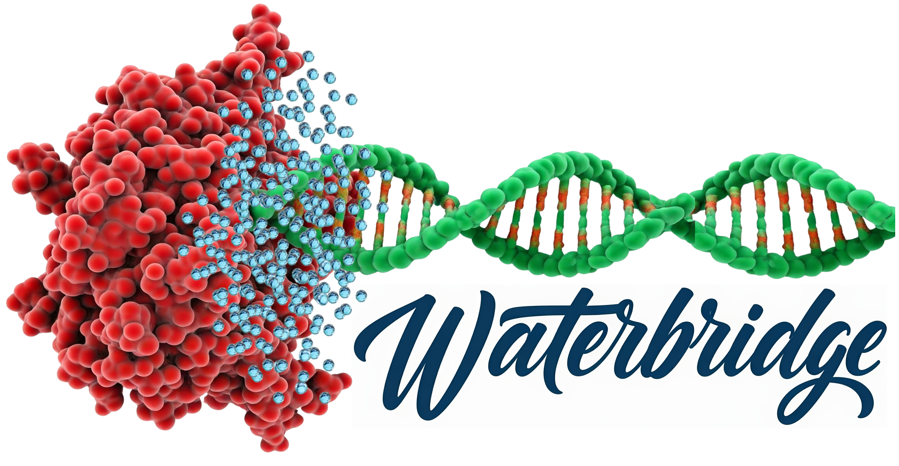

This code is written in python3. To run this code, go through the following steps:
1.	Place all three codes (‘1_Identification of water bridges.py’, ‘2_Topological classification of water bridges.py’, and ‘3_Nomenclature of A1-w-N1 waterbridges.py’) into a folder along with ‘.hb2’ files obtained from HBPLUS and respective PDB files.
   
2.	Double click ‘1_Identification of water bridges.py’, the code will run automatically and generate three text files:- 
        ‘waterbridges_ALL.txt’ – contains all identified water bridges.
 	    ‘waterbridges_Base.txt’ – contains all identified water bridges involving at least one ribonucleotide utilizing its nucleobase moiety to form hydrogen bonds with water.
        ‘waterbridges_RiboPhos.txt’ – contains all other identified water bridges involving only phosphate moiety or ribose moiety.

3.	For demonstration, we used ‘waterbridges_Base.txt’. Double click on ‘2_Topological classification of water bridges.py’, it will classify water bridges according to their topology and generate many test files, one for each topology (‘A1-w-N1_Base.txt’, ‘A1-w-B2_Base’)
  
4. Now, run ‘3_Nomenclature of A1-w-N1 waterbridges.py’, to assign a name to each base-mediated water bridge present in ‘waterbridges_Base.txt’. This will generate a file ‘classified_A1-w-B1_waterbridges’.


# Waterbridge: A python code for detection of water bridges in RNA–protein complexes

Water plays an important role in the assembly, stability, and function of RNA–protein complexes. Water forms directional interactions, and its dynamic clusters contribute to molecular recognition. To gain a deeper understanding, we developed a graph theory-based classification scheme for water-mediated amino acid-ribonucleotide motifs, categorizing them into triplets, quartets, and quintet bridging topologies, with further sub-topologies. This categorization not only enhances insights into biomolecular dynamics but also informs the rational design of RNA–protein complexes, providing a framework for potential applications in bioinformatics and therapeutics.

<!--- BADGES: START --->


[#pypi-package]: https://pypi.org/project/pip-api/
[#conda-forge-package]: https://anaconda.org/conda-forge/pip-api
[#conda-forge-feedstock]: https://github.com/conda-forge/pip-api-feedstock
<!--- BADGES: END --->

## Features

1. **Water Bridge Identification**: Identifies water bridges in RNA–protein complexes based on the output of HBPLUS.
2. **Topological Classification**: Analyzes and classifies the topology of identified water bridges, such as A1-w-N1 and A1-w-N2.
3. **Nomenclature Generation**: Provides specific nomenclature for the identified topologies, like A1-w-N1.

## Installation

1. Clone the repository to your local machine:

    ```bash
    git clone https://github.com/yourusername/waterbridge_tool.git
    ```

2. Navigate to the project directory:

    ```bash
    cd waterbridge_tool
    ```

3. Install the package (if packaging for PyPI):

    ```bash
    pip install .
    ```

## Usage

After installation, you can use the `waterbridge` command in your terminal. Here’s how to run the different parts of the tool:

### Command-Line Usage

```bash
waterbridge -1
